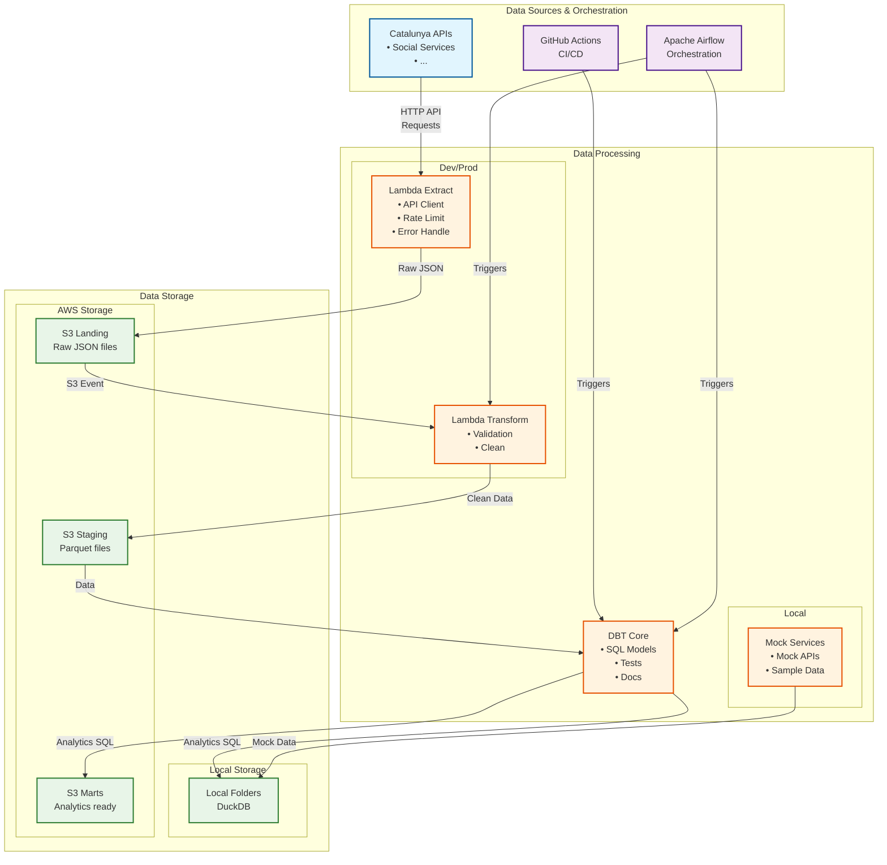

# System Architecture

## Overview

The Catalunya Open Data Pipeline is designed as a multi-environment data platform that extracts, transforms, and loads (ETL) open data from Catalunya government sources using Apache Airflow orchestration across three distinct environments.

## Environment Architecture

### Local Environment
- **Purpose**: Isolated development of individual modules with full mocking
- **Storage**: Local folders, DuckDB database
- **Orchestration**: Apache Airflow (Docker Compose)  
- **Processing**: Mocked services for rapid development
- **Data Sources**: Mock APIs and sample data files

### Development Environment
- **Purpose**: Production-like testing with full AWS integration
- **Storage**: AWS S3, AWS Athena with Glue Data Catalog
- **Orchestration**: Apache Airflow (Dokku on-premise server)
- **Processing**: Full AWS Lambda integration
- **Data Sources**: Real Catalunya APIs with development configurations

### Production Environment  
- **Purpose**: Production workloads with high availability
- **Storage**: AWS S3, AWS Athena with Glue Data Catalog
- **Orchestration**: Apache Airflow (Dokku on-premise server)
- **Processing**: Full AWS Lambda integration  
- **Data Sources**: Real Catalunya APIs with production configurations

## Architecture Diagram



## Data Flow Layers

### 1. Landing Layer (`s3://bucket/landing/`)

**Purpose**: Store raw, unprocessed data exactly as received from source APIs.

**Characteristics**:

- **Format**: JSON files
- **Partitioning**: `source/partition=partition_value/partitions_.json`
- **Retention**: ephemeral, deleted once further staging dependency fulfills data quality.
- **Processing**: No transformations, direct API response storage

**Example Structure**:

```
s3://catalunya-data-dev/landing/
├── social_services/ingested_process_at=20250803T140512/files.json
└── social_services/ingested_process_at=20250803T150134/files.json
```

### 2. Staging Layer (`s3://bucket/staging/`)

**Purpose**: Store cleaned, validated, and standardized data ready for analytics.

**Characteristics**:

- **Format**: Parquet (columnar, compressed)
- **Partitioning**: `source/functional_partition=partition_vale`
- **Retention**: 3 months
- **Processing**: Data cleaning, validation, type casting, deduplication

**Schema Enforcement**:

- Consistent column
  names [dbt Labs suggestions](https://docs.getdbt.com/best-practices/how-we-style/1-how-we-style-our-dbt-models)
- Standardized data types
- Required field validation
- Data quality checks

**Example Structure**:

```
s3://catalunya-data-dev/staging/
├── social_services/district_id=01/file.parquet
└── social_services/district_id=02/file.parquet
```

### 3. Marts Layer (`s3://bucket/marts/`)

**Purpose**: Business-ready dimensional models optimized for analytics and reporting.

**Characteristics**:

- **Format**: Parquet (optimized for queries)
- **Partitioning**: Optimized for common query patterns
- **Retention**: 3 months
- **Processing**: Dimensional modeling, aggregations, business logic

**Model Types**:

- **Dimension Tables**: Reference data (municipalities, sectors, etc.)
- **Fact Tables**: Metrics and measurements over time
- **Aggregate Tables**: Pre-computed summaries for performance

**Example Structure**:

```
s3://catalunya-data-dev/marts/
├── dimensions/
│   ├── dim_municipalities.parquet
│   ├── dim_economic_sectors.parquet
│   └── dim_time.parquet
├── facts/
│   ├── fact_population_monthly.parquet
│   ├── fact_gdp_quarterly.parquet
│   └── fact_service_usage_daily.parquet
└── aggregates/
    ├── agg_population_trends_yearly.parquet
    └── agg_economic_indicators_quarterly.parquet
```

## Technology Stack Details

### Apache Airflow

**Local Environment**:
- **Runtime**: Docker Compose with LocalExecutor
- **Database**: PostgreSQL (containerized)
- **Configuration**: Single container with webserver/scheduler

**Development/Production Environments**:
- **Runtime**: Dokku deployment on on-premise servers
- **Database**: PostgreSQL (managed or containerized)
- **Configuration**: Multi-process setup with separate workers

### Data Processing

**Local Environment**:
- **Database**: DuckDB for development and testing
- **Storage**: Local filesystem and Docker volumes
- **Processing**: Python scripts with mocked external services

**Development/Production Environments**:
- **AWS Lambda**: Python 3.9 runtime for data extraction/transformation
- **Amazon S3**: Multi-tier storage (Landing, Staging, Marts)
- **Amazon Athena**: SQL query engine with Glue Data Catalog

### DBT Core

**Purpose**: SQL-based transformations and data modeling

**Features**:
- **Incremental Models**: Process only new/changed data
- **Testing**: Automated data quality tests
- **Documentation**: Auto-generated data catalog
- **Lineage**: Track data dependencies

**Adapters**:
- **Local**: DuckDB adapter
- **Development/Production**: Athena adapter

### Infrastructure

**Local Environment**:
- **Orchestration**: Docker Compose
- **Configuration**: Environment variables and local files

**Development/Production Environments**:
- **Infrastructure as Code**: AWS CDK (TypeScript)
- **Deployment**: Dokku for Airflow, CDK for AWS resources
- **Monitoring**: CloudWatch and Airflow native monitoring

## Security Architecture

### Local Environment
- **Access Control**: Local Docker containers, no external access required
- **Data Security**: Local filesystem permissions, development data only
- **Network**: Isolated Docker network, localhost access only

### Development/Production Environments

### Access Control

**Principle of Least Privilege**:
- Lambda functions have minimal required permissions
- Cross-account access through assumed roles
- Resource-based policies for S3 buckets

**IAM Structure**:

#### **Catalunya Data Engineer Role** (`catalunya-data-engineer-role`)
**Purpose**: Primary development and management role for the data pipeline project.

**Intended Users**: Project maintainers and core developers who need comprehensive access to develop, deploy, and manage the Catalunya data pipeline infrastructure.

**Access Pattern**: Assumed by IAM users with MFA authentication required for security compliance.

#### **Service Account Roles**

**Lambda Extractor Roles**
- `catalunya-lambda-extractor-role-dev`
- `catalunya-lambda-extractor-role-prod`

**Purpose**: Execute data extraction operations from Catalunya government APIs to the landing layer.

**Runtime Context**: AWS Lambda functions triggered by Apache Airflow on defined intervals (daily/weekly).

**Data Flow Position**: External APIs → Lambda Extractor → S3 Landing Layer

**Security Boundaries**: 
- Can only write to S3 landing layer (`s3://catalunya-data-{env}/landing/*`)
- Internet access for external API calls

**Lambda Transformer Roles**
- `catalunya-lambda-transformer-role-dev`
- `catalunya-lambda-transformer-role-prod`

**Purpose**: Process and clean raw data from landing layer into validated, analytics-ready format in staging layer.

**Runtime Context**: AWS Lambda functions triggered by Apache Airflow workflows.

**Data Flow Position**: S3 Landing Layer → Lambda Transformer → S3 Staging Layer

**Security Boundaries**:
- Read access to S3 landing layer only
- Write access to S3 staging layer only

**GitHub Actions Deployment Roles**
- `catalunya-deployment-role-dev` (OIDC: develop branch)
- `catalunya-deployment-role-prod` (OIDC: main branch)

**Purpose**: Deploy infrastructure and application updates through CI/CD pipelines.

**Runtime Context**: GitHub Actions workflows triggered by code pushes to specific branches.

**Security Boundaries**:
- OIDC authentication tied to specific Git branches (develop/main)
- CloudFormation deployment permissions
- Environment-specific resource access

**Mart Processing Roles**
- `catalunya-mart-role-dev`
- `catalunya-mart-role-prod`

**Purpose**: Execute DBT transformations to create business-ready analytics models from staging data.

**Runtime Context**: Apache Airflow DAGs executing DBT Core commands.

**Data Flow Position**: S3 Staging Layer → DBT/Athena → S3 Marts Layer

**Security Boundaries**:
- Read access to S3 staging layer and Glue Data Catalog
- Write access to S3 marts layer
- Athena query execution permissions within designated workgroup
- Access to dedicated Athena results S3 bucket

**Monitoring Roles**
- `catalunya-monitoring-role-dev`
- `catalunya-monitoring-role-prod`

**Purpose**: Operational observability, alerting, and cost optimization across the data pipeline.

**Runtime Context**: Monitoring services and alerting systems.

**Security Boundaries**:
- Read-only access to all data layers for monitoring purposes
- CloudWatch and SNS permissions for alerting
- Cost Explorer access for usage analysis

### Network Security

**Local Environment**:
- Docker network isolation
- No external network access required

**Development/Production Environments**:
- Lambda functions with internet access for API calls
- Dokku server network configuration for Airflow
- VPC configuration as needed for security isolation

## Monitoring & Observability

### Local Environment

**Monitoring Tools**:
- Airflow Web UI at http://localhost:8080
- Local log files in orchestration/logs/
- DuckDB database inspection and query tools
- Docker container logs via `docker-compose logs`

**Metrics Available**:
- DAG execution status and duration
- Local data processing metrics
- Container resource usage

### Development/Production Environments

**Airflow Monitoring**:
- Airflow Web UI on Dokku servers
- DAG execution logs and metrics
- Task failure notifications
- Scheduler and worker health monitoring

**AWS Infrastructure Monitoring**:
- CloudWatch Logs for Lambda functions
- Custom CloudWatch metrics for data pipeline health
- SNS notifications for pipeline failures
- CloudWatch Dashboard for operational overview

**Data Quality Monitoring**:
- DBT test results and data lineage
- Data freshness indicators
- Schema drift detection
- Row count and quality metrics

### Logging Strategy

**Log Levels**:
- **ERROR**: Pipeline failures, data quality issues
- **WARN**: API timeouts, retry attempts  
- **INFO**: Successful processing, row counts
- **DEBUG**: Detailed processing steps (local/dev only)

**Log Aggregation**:
- Local: File-based logging
- Development/Production: CloudWatch Log Groups + Airflow logs
- Structured JSON logging with correlation IDs

### Dashboards

**Local Environment**:
- Airflow UI for pipeline monitoring
- Local development metrics

**Development/Production Environments**:
- Operational Dashboard: Pipeline health, processing times, error rates
- Business Dashboard: Data freshness, dataset availability, query performance
- Cost Dashboard: Resource usage and cost tracking

## Scalability Considerations

### Local Environment

**Resource Management**:
- Docker container resource limits
- DuckDB performance tuning for development datasets
- Local storage management and cleanup

### Development/Production Environments

**Airflow Scaling**:
- Dokku process scaling for worker nodes
- Task parallelization and resource allocation
- Queue management for task distribution

**AWS Lambda Scaling**:
- Concurrency management for consistent performance
- Dead letter queues for failed executions
- Retry logic with exponential backoff

**Storage Performance**:
- S3 request patterns with random prefixes
- Multipart upload for large files
- Transfer acceleration for global access

**Query Engine Optimization**:
- Athena query performance with partitioning
- Columnar format (Parquet) for analytical workloads
- Compression to reduce scan costs
- DuckDB optimization for local development

## Cost Optimization

### Local Environment
- **Infrastructure Cost**: $0 (runs entirely on local machine)
- **Resource Usage**: Minimal Docker container overhead
- **Development Speed**: Fast iteration without cloud costs

### Development Environment
| Service         | Usage                  | Estimated Cost |
|-----------------|------------------------|----------------|
| S3 Storage      | 10GB across all layers | $0.25/month    |
| Lambda Requests | 5K invocations/month   | $1.00/month    |
| Athena Queries  | 50GB scanned/month     | $2.50/month    |
| CloudWatch      | Logs + Metrics         | $2.00/month    |
| Dokku Server    | On-premise hosting     | Variable       |
| **Total**       |                        | **~$5.75 + hosting** |

### Production Environment
| Service         | Usage                   | Estimated Cost |
|-----------------|-------------------------|----------------|
| S3 Storage      | 50GB across all layers  | $1.25/month    |
| Lambda Requests | 20K invocations/month   | $4.00/month    |
| Athena Queries  | 200GB scanned/month     | $10.00/month   |
| CloudWatch      | Enhanced monitoring     | $5.00/month    |
| Dokku Server    | Production hosting      | Variable       |
| **Total**       |                         | **~$20.25 + hosting** |

### Cost Controls

**Automated Controls**:
- Billing alerts for AWS services
- S3 lifecycle policies for data archival
- Lambda timeout limits to prevent runaway costs
- Resource tagging for cost allocation

**Manual Reviews**:
- Monthly cost analysis by environment
- Query optimization reviews for Athena usage
- Storage utilization assessment and cleanup

## Disaster Recovery

### Local Environment
- **Data Backup**: Git version control for code, local data is ephemeral
- **Recovery**: Simple `git clone` and `docker-compose up`
- **Development Impact**: Minimal, isolated environment

### Development/Production Environments

**Backup Strategy**:
- S3 Cross-Region Replication for critical data
- Git version control for all code and infrastructure
- Database exports of Airflow metadata and configurations
- Dokku server backup procedures

**Recovery Procedures**:
- Infrastructure recreation via AWS CDK
- Airflow deployment restoration via Dokku
- Data restore from backup S3 buckets
- Pipeline restart and validation procedures

**Business Continuity**:
- Catalunya API availability monitoring
- AWS service health monitoring
- Dokku server health and failover planning
- Alternative data source identification
- Stakeholder communication plans

**Recovery Time Objectives (RTO)**:
- Local: < 30 minutes
- Development: < 2 hours  
- Production: < 4 hours

**Recovery Point Objectives (RPO)**:
- Local: N/A (ephemeral data)
- Development: < 24 hours
- Production: < 4 hours