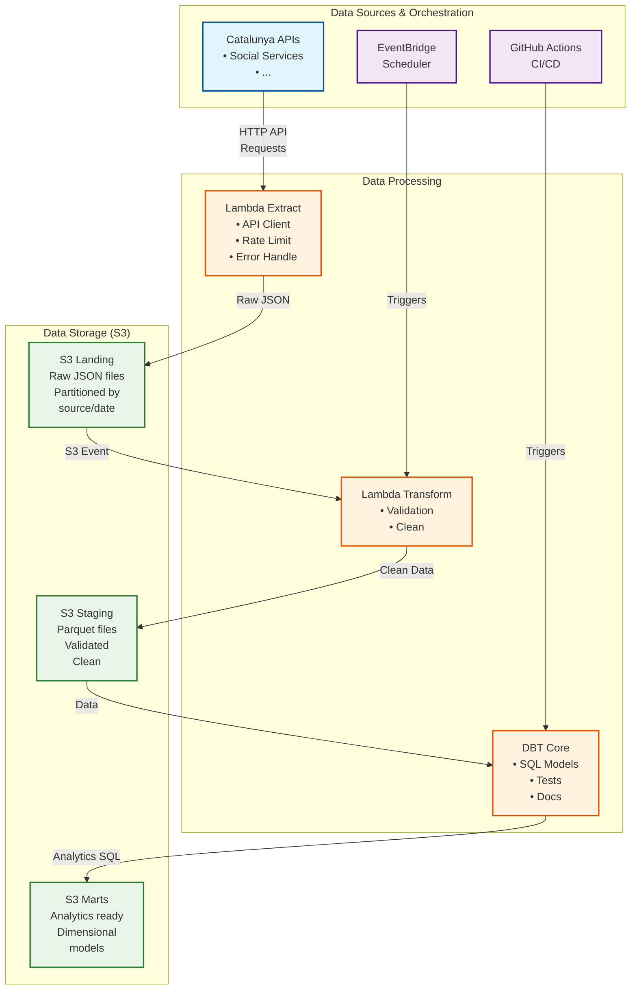

# System Architecture

## Overview

The Catalunya Open Data Pipeline is designed as a modern, serverless data platform that extracts, transforms, and
loads (ETL) open data from Catalunya government sources into a queryable data lake architecture.

## Architecture Diagram



## Data Flow Layers

### 1. Landing Layer (`s3://bucket/landing/`)

**Purpose**: Store raw, unprocessed data exactly as received from source APIs.

**Characteristics**:

- **Format**: JSON files
- **Partitioning**: `source/partition=partition_value/partitions_.json`
- **Retention**: ephemeral, deleted once further staging dependency fulfills data quality.
- **Processing**: No transformations, direct API response storage

**Example Structure**:

```
s3://catalunya-data-dev/landing/
├── social_services/ingested_process_at=20250803T140512/files.json
└── social_services/ingested_process_at=20250803T150134/files.json
```

### 2. Staging Layer (`s3://bucket/staging/`)

**Purpose**: Store cleaned, validated, and standardized data ready for analytics.

**Characteristics**:

- **Format**: Parquet (columnar, compressed)
- **Partitioning**: `source/functional_partition=partition_vale`
- **Retention**: 3 months
- **Processing**: Data cleaning, validation, type casting, deduplication

**Schema Enforcement**:

- Consistent column
  names [dbt Labs suggestions](https://docs.getdbt.com/best-practices/how-we-style/1-how-we-style-our-dbt-models)
- Standardized data types
- Required field validation
- Data quality checks

**Example Structure**:

```
s3://catalunya-data-dev/staging/
├── social_services/district_id=01/file.parquet
└── social_services/district_id=02/file.parquet
```

### 3. Marts Layer (`s3://bucket/marts/`)

**Purpose**: Business-ready dimensional models optimized for analytics and reporting.

**Characteristics**:

- **Format**: Parquet (optimized for queries)
- **Partitioning**: Optimized for common query patterns
- **Retention**: 3 months
- **Processing**: Dimensional modeling, aggregations, business logic

**Model Types**:

- **Dimension Tables**: Reference data (municipalities, sectors, etc.)
- **Fact Tables**: Metrics and measurements over time
- **Aggregate Tables**: Pre-computed summaries for performance

**Example Structure**:

```
s3://catalunya-data-dev/marts/
├── dimensions/
│   ├── dim_municipalities.parquet
│   ├── dim_economic_sectors.parquet
│   └── dim_time.parquet
├── facts/
│   ├── fact_population_monthly.parquet
│   ├── fact_gdp_quarterly.parquet
│   └── fact_service_usage_daily.parquet
└── aggregates/
    ├── agg_population_trends_yearly.parquet
    └── agg_economic_indicators_quarterly.parquet
```

## Technology Stack Details

### AWS Lambda

**Extract Functions**:

- **Runtime**: Python 3.9
- **Timeout**: 15 minutes max

**Transform Functions**:

- **Runtime**: Python 3.9
- **Timeout**: 15 minutes max
- **Libraries**: Pandas, PyArrow for data processing

### Amazon S3

**Storage Classes**:

- **Landing**: Standard (ephemeral)
- **Staging**: Standard (infrequent access after processing)
- **Marts**: Standard (frequent analytics access)

**Lifecycle Policies**:

- Staging → Standard-IA after 30 days → Deleted after 3 months

### Amazon Athena

**Purpose**: SQL query engine for data lake analytics

**Configuration**:

- **Workgroup**: Separate workgroups for dev/prod environments
- **Result Location**: Dedicated S3 bucket for query results
- **Data Source**: AWS Glue Data Catalog tables

### DBT Core

**Purpose**: SQL-based transformations and data modeling

**Features**:

- **Incremental Models**: Process only new/changed data
- **Testing**: Automated data quality tests
- **Documentation**: Auto-generated data catalog
- **Lineage**: Track data dependencies

### AWS CDK (TypeScript)

**Purpose**: Infrastructure as Code

**Stacks**:

- **Storage Stack**: S3 buckets, lifecycle policies
- **Compute Stack**: Lambda functions, EventBridge rules
- **Security Stack**: IAM roles, policies, KMS keys
- **Monitoring Stack**: CloudWatch dashboards, alarms

## Security Architecture

### Access Control

**Principle of Least Privilege**:

- Lambda functions have minimal required permissions
- Cross-account access through assumed roles
- Resource-based policies for S3 buckets

**IAM Structure**:

### Human Roles

#### **Catalunya Data Engineer Role** (`catalunya-data-engineer-role`)
**Purpose**: Primary development and management role for the data pipeline project.

**Intended Users**: Project maintainers and core developers who need comprehensive access to develop, deploy, and manage the Catalunya data pipeline infrastructure.

**Access Pattern**: Assumed by IAM users with MFA authentication required for security compliance.

### Service Account Roles

#### **Lambda Extractor Roles**
- `catalunya-lambda-extractor-role-dev`
- `catalunya-lambda-extractor-role-prod`

**Purpose**: Execute data extraction operations from Catalunya government APIs to the landing layer.

**Runtime Context**: AWS Lambda functions triggered by EventBridge schedulers on defined intervals (daily/weekly).

**Data Flow Position**: External APIs → Lambda Extractor → S3 Landing Layer

**Security Boundaries**: 
- Can only write to S3 landing layer (`s3://catalunya-data-{env}/landing/*`)
- Internet access for external API calls

#### **Lambda Transformer Roles**
- `catalunya-lambda-transformer-role-dev`
- `catalunya-lambda-transformer-role-prod`

**Purpose**: Process and clean raw data from landing layer into validated, analytics-ready format in staging layer.

**Runtime Context**: AWS Lambda functions triggered by S3 events when new files arrive in landing layer.

**Data Flow Position**: S3 Landing Layer → Lambda Transformer → S3 Staging Layer

**Security Boundaries**:
- Read access to S3 landing layer only
- Write access to S3 staging layer only

#### **GitHub Actions Deployment Roles**
- `catalunya-deployment-role-dev` (OIDC: develop branch)
- `catalunya-deployment-role-prod` (OIDC: main branch)

**Purpose**: Execute DBT transformations to create business-ready analytics models from staging data.

**Runtime Context**: GitHub Actions workflows triggered by code pushes to specific branches or scheduled executions.

**Data Flow Position**: S3 Staging Layer → DBT Core → S3 Marts Layer

**Security Boundaries**:
- OIDC authentication tied to specific Git branches (develop/main)
- Read access to S3 staging layer only
- Write access to S3 marts layer only
- 
**Design Rationale**: Separates business logic transformations from data ingestion, enables SQL-based analytics development, and provides git-based version control for transformation logic with proper environment isolation.

#### **Production Deployment Role**
- `catalunya-deployment-role-prod` (OIDC: main branch only)

**Purpose**: Automated infrastructure deployment to production environment through CDK.

**Runtime Context**: GitHub Actions workflow triggered only by pushes to main branch after successful testing.

**Data Flow Position**: Infrastructure as Code → AWS CloudFormation → Production Resources

**Security Boundaries**:
- OIDC authentication restricted to main branch only
- Full CloudFormation permissions for production environment only
**Design Rationale**: Ensures production deployments are automated, auditable, and can only be triggered through controlled release processes, reducing human error and maintaining deployment consistency.

#### **Monitoring Roles**
- `catalunya-monitoring-role-dev`
- `catalunya-monitoring-role-prod`

**Purpose**: Operational observability, alerting, and cost optimization across the data pipeline.

**Runtime Context**: Lambda functions triggered by CloudWatch Events for periodic monitoring tasks.

**Data Flow Position**: Cross-cutting across all pipeline components for observability.

**Security Boundaries**:
- Read-only access to all data layers for monitoring purposes
- Cannot modify pipeline data or trigger processing operations
- CloudWatch and SNS permissions for alerting
- Cost Explorer access for usage analysis

**Design Rationale**: Independent monitoring ensures observability remains available during pipeline failures, enables proactive issue detection, and provides centralized operational intelligence without interfering with data processing operations.

### Network Security

**Lambda Functions**:

- No VPC configuration required (public API access)
- Internet gateway for API calls
- NAT gateway if VPC isolation needed

## Monitoring & Observability

### CloudWatch Metrics

**Custom Metrics**:

- Data pipeline success/failure rates
- Processing latency by stage
- Data volume processed
- API response times and error rates

**Alarms**:

- Pipeline failure notifications
- Cost threshold alerts
- Performance degradation warnings

### Logging Strategy

**Log Levels**:

- **ERROR**: Pipeline failures, data quality issues
- **WARN**: API timeouts, retry attempts
- **INFO**: Successful processing, row counts
- **DEBUG**: Detailed processing steps (dev only)

**Log Aggregation**:

- Centralized CloudWatch Log Groups
- Structured JSON logging
- Correlation IDs for request tracing

### Dashboards

**Operational Dashboard**:

- Pipeline health status
- Processing times and volumes
- Error rates and types
- Cost tracking

**Business Dashboard**:

- Data freshness indicators
- Dataset availability
- Query performance metrics

## Scalability Considerations

### Lambda Scaling

**Concurrency Management**:

- Reserved concurrency for consistent performance
- Dead letter queues for failed executions
- Retry logic with exponential backoff

### S3 Performance

**Request Patterns**:

- Random prefix patterns for high request rates
- Multipart upload for large files
- Transfer acceleration for global access

### Athena Optimization

**Query Performance**:

- Partitioning strategy aligned with query patterns
- Columnar format (Parquet) for analytical workloads
- Compression to reduce scan costs

## Cost Optimization

### Expected Monthly Costs (Development)

| Service         | Usage                  | Cost        |
|-----------------|------------------------|-------------|
| S3 Storage      | 10GB across all layers | $0.25       |
| Lambda Requests | 10K invocations/month  | $2.00       |
| Athena Queries  | 100GB scanned/month    | $5.00       |
| CloudWatch      | Logs + Metrics         | $3.00       |
| Data Transfer   | Minimal (same region)  | $1.00       |
| **Total**       |                        | **~$11.25** |

### Cost Controls

**Automated Controls**:

- Billing alerts at $15, $25, $30 thresholds
- S3 lifecycle policies for data archival
- Lambda timeout limits to prevent runaway costs

**Manual Reviews**:

- Monthly cost analysis
- Query optimization reviews
- Storage utilization assessment

## Disaster Recovery

### Backup Strategy

**Data Backup**:

- S3 Cross-Region Replication for critical data
- Version control for all infrastructure code
- Database of API schemas and configurations

**Recovery Procedures**:

- Infrastructure recreation via CDK
- Data restore from backup locations
- Pipeline restart and validation procedures

### Business Continuity

**Service Dependencies**:

- Catalunya API availability monitoring
- AWS service health monitoring
- Alternative data source identification

**Fallback Procedures**:

- Manual data collection processes
- Historical data gap filling procedures
- Stakeholder communication plans````